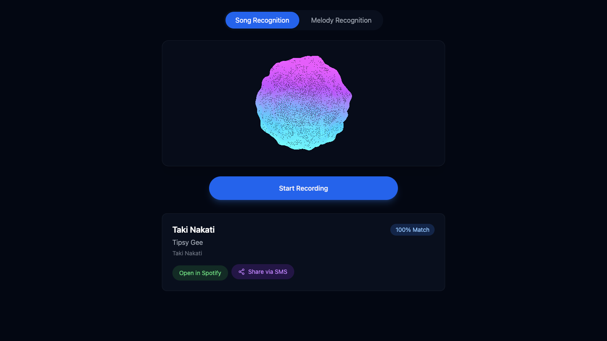

# 🎵 Music Recognition Web App

## 📌 Overview
This web application allows users to recognize songs through both direct audio input and humming/mumbling/whistling/singing etc. It leverages the ACRCloud API for melody detection and Africa's Talking SMS service for song sharing. The app functions similarly to Shazam but includes melody recognition through humming/mumbling/whistling/singing.

  

[Live Demo](https://vibenoma-frontend.vercel.app/) 

## 🚀 Features
- 🎤 **Song Recognition**: Identify songs from recorded or live audio.
- 🎶 **Melody Recognition**: Recognize songs by humming/mumbling/whistling/singing.
- 📡 **API Integration**: Utilizes ACRCloud API for accurate song detection.
- 📲 **SMS Notifications**: Sends song details to users via Africa's Talking SMS service.
- 🎨 **Visually Impressive UI**: Futuristic animations enhance user experience.

## 🛠️ Tech Stack
- **Frontend**: Vite, React, Tailwind CSS
- **Backend**: Node.js (if applicable)
- **APIs**:
  - ACRCloud API (Melody & Song Recognition)
  - Africa's Talking SMS API (Song Details Notification)
- **Deployment**: (Add details if deployed on Vercel, Netlify, etc.)

## 🌍 Live Demo
[Live Demo](#) <!-- Replace `#` with your live demo URL -->

## 📖 Setup & Installation
1. **Clone the repository**:
   ```sh
   git clone https://github.com/yourusername/music-web-app.git
   cd music-web-app
   ```
2. **Install dependencies**:
   ```sh
   npm install
   ```
3. **Set up environment variables**:
   Create a `.env` file and add the following:
   ```env
   VITE_ACRCLOUD_API_KEY=your_api_key
   VITE_AFRICASTALKING_API_KEY=your_api_key
   ```
4. **Run the development server**:
   ```sh
   npm run dev
   ```
5. **Open in browser**:
   - Visit `http://localhost:5173/` (or the specified port in your setup)

## 📸 Screenshots
(Add screenshots/gifs of the UI here)

## 🔮 Future Enhancements
- 🌍 Support for multiple languages.
- 📊 Advanced analytics on song searches.
- 🤖 AI-powered recommendations based on user searches.
- 📻 Integration with music streaming services.

## 🏆 Credits
- **Developer**: Philip Machar
- **APIs Used**: ACRCloud, Africa's Talking

## 📜 License
This project is licensed under the [MIT License](LICENSE).

## 📬 Contact
- Email: your.email@example.com
- LinkedIn: [Your Profile](https://www.linkedin.com/in/yourprofile)
- GitHub: [@yourusername](https://github.com/yourusername)

